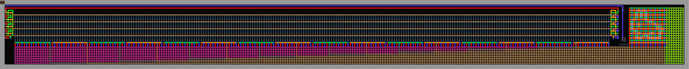
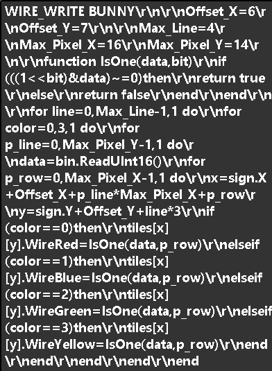

# Wire Write
Wire Write 是一个可以向泰拉瑞亚储存电路中写入数据的独立程序。

## 使用

***注：Wire Write 使用了[.NET 8.0](https://dotnet.microsoft.com/zh-cn/download/dotnet/8.0 ".NET 8.0")，如果没有安装，请点击蓝色的字安装***

你可以使用下面的指令打开 Wire Write：

```shell
wirewrite <地图文件名> <数据文件名>
```

也可以直接打开 Wire Write ，然后再输入地图文件和数据文件名。  

文件名可以是完整的路径，也可以只有文件名。程序会按照下面的顺序搜索文件：

> 程序运行目录  
> 泰拉瑞亚原版地图目录  
> 泰拉瑞亚模组地图目录

之后 Wire Write 会执行地图文件内的 Lua 脚本，将数据文件里的数据写入到脚本指定的储存电路中。

## 示例

你可以在`Example`文件夹中找到`Bunny.wld`和`Bunny.bin`，将`Bunny.wld`放到泰拉瑞亚的地图目录，将`Bunny.bin`放到程序运行目录。  

之后使用下面的指令（或直接打开 Wire Write ，然后手动输入地图文件名和数据文件名）：

```shell
wirewrite Bunny.wld Bunny.bin
```

这条指令打开会地图文件`Bunny.wld`，执行里面的脚本，将数据文件`Bunny.bin`里面的数据写入到脚本指定的只读储存器中。

  
***Bunny.wld内的ROM，脚本在左上角的告示牌内***
***
之后再进入地图，激活拉杆，你应该会看到类似下面的效果:

    

**兔子动了起来！**  

实际上，将视频写入只读储存器只是 Wire Write 功能的一部分。它完全可以将任何计算机可以处理和表示的数据（文字、图片、视频、程序等等）写入到绝大部分的储存电路中（寄存器、只读储存器、可读写储存器、顺序储存器、随机储存器等等）。  
只需要改变储存电路左上角的告示牌内的`Lua`脚本即可。 

***注：`Lua`语言是与`C`语言类似的脚本语言，如果你会`C`语言的话，可以直接编写`Lua`脚本，只需要注意一点点与C不同的地方***

***
但是当你打开左上角的告示牌，会看见一大堆像乱码的东西：  

<details>
<summary>点击展开 告示牌内容</summary>

  
</details>

######

别担心，告示牌的内容与`Bunny.lua`的内容完全相同，只是将所有换行符`/r/n`替换为`//r//n`而已。

<details>
<summary>点击展开 Bunny.lua</summary>

```lua
WIRE_WRITE BUNNY

-- 储存电路起始坐标相对于告示牌左上角坐标的偏移
Offset_X = 6
Offset_Y = 7

-- 储存电路最大行数，每行有四种颜色
Max_Line = 4
-- 屏幕像素大小
Max_Pixel_X = 16
Max_Pixel_Y = 14

-- 判断 data 的第 bit 位是否是1
function IsOne(data, bit)
	if(((1 << bit) & data) ~= 0) then
		return true
	else
		return false
	end
end

-- 遍历储存电路的所有行
for line = 0, Max_Line - 1, 1 do
	-- 遍历储存电路每行中所有颜色
	for color = 0, 3, 1 do
		-- 遍历屏幕的所有行
		for p_line = 0, Max_Pixel_Y - 1, 1 do
			-- 从数据文件中读取数据
			data = bin.ReadUInt16()
			-- 遍历屏幕每行中所有列
			for p_row = 0, Max_Pixel_X - 1, 1 do
				-- 计算出当前数据写入位置坐标
				-- 水平坐标为：告示牌水平坐标、水平偏移、每行最大像素倍屏幕行数、屏幕列数 之和 
				x = sign.X + Offset_X + p_line * Max_Pixel_X + p_row
				-- 竖直坐标为：告示牌竖直坐标、竖直偏移、三倍行数（每行有三格高） 之和 
				y = sign.Y + Offset_Y + line * 3
				-- 判断当前电线颜色，将电线设为数据当前位对应的值
				if(color == 0) then
					tiles[x][y].WireRed = IsOne(data, p_row)
				elseif(color == 1)then
					tiles[x][y].WireBlue = IsOne(data, p_row)
				elseif(color == 2)then
					tiles[x][y].WireGreen = IsOne(data, p_row)
				elseif(color == 3)then
					tiles[x][y].WireYellow = IsOne(data, p_row)
				end
			end
		end
	end
end
```
</details>  
  
######

***注：为什么要转义换行符？因为泰拉瑞亚的告示牌会限制换行符的数量，但是每行的长度没有限制。所以需要将转义后再写入告示牌。***

## 脚本

***注：脚本使用的框架为[NeoLua](https://github.com/neolithos/neolua)，语法为Lua 5.3***

脚本由下面的三部分组成：

```lua
WIRE_WRITE <脚本标题>
<脚本内容>
```

其中，`WIRE_WRITE`是脚本必须要有的前缀，标记了这是一个 Wire Write 使用的脚本。  

脚本执行时，Wire Write 会向脚本传入三个变量：

| 名称 | 类型 | 说明 |
| :--- | :--- | :--- |
| sign | Script | 脚本所在的告示牌 |
| tiles | Tile[][] | 脚本所在世界的图格数据 |
| bin | BinaryReader | 数据文件的二进制读取器 |
***
`Script`类型包括以下的属性：

| 名称 | 类型 | 说明 |
| :--- | :--- | :--- |
| Title | string | 脚本的标题 |
| Text | string | 脚本的内容 |
| X | int | 告示牌左上角图格的横坐标 |
| Y | int | 告示牌左上角图格的纵坐标 |
***
`tiles`是一个`Tile`类交错数组，可以使用下面的形式获得坐标为`(x ,y)`的图格数据：

```lua
tiles[x][y]
```
`Tile`类型包括以下的字段：

| 名称 | 类型 | 说明 |
| :--- | :--- | :--- |
| IsActiv | bool | 物块是否活动，非空的物块应为True（由于ID 0存在物块，所以使用额外的变量判断物块是否为空） |
| Type | ushort | [物块的ID](https://terraria.wiki.gg/wiki/Tile_IDs "Tile IDs") |
| Wall | ushort | [墙壁的ID](https://terraria.wiki.gg/wiki/Wall_IDs "Wall IDs") |
| U | Int16 | 物块框架的横坐标（例如亮/灭/故障逻辑灯的物块ID相同，但框架横坐标不同） |
| V | Int16 | 物块框架的纵坐标 |
| BrickStyle | BrickStyle | 物块的半砖类型（枚举，有Full，HalfBrick，SlopeTopRight，SlopeTopLeft，SlopeBottomRight，SlopeBottomLeft 六种） |
| WireRed | bool | 是否有红色电线 |
| WireBlue | bool | 是否有蓝色电线 |
| WireGreen | bool | 是否有绿色电线 |
| WireYellow | bool | 是否有黄色电线 |
| Actuator | bool | 是否有制动器 |
| InActive | bool | 是否虚化 |
| LiquidType | LiquidType | 液体的类型（枚举，有None，Water，Lava，Honey，Shimmer 五种） |
| LiquidAmount | byte | 液体的量（0为空，255为满） |
| TileColor | byte | [物块的油漆](https://terraria.wiki.gg/wiki/Paints "Paints") |
| WallColor | byte | [墙壁的油漆](https://terraria.wiki.gg/wiki/Paints "Paints") |
| InvisibleBlock | bool | 物块是否隐形 |
| InvisibleWall | bool | 墙壁是否隐形 |
| FullBrightBlock | bool | 物块是否全亮 |
| FullBrightWall | bool | 墙壁是否全亮 |

***注：仅列出`Tile`类型的部分内容，详细内容请参看代码***  
***
小型储存电路脚本可以参考[`Bunny.lua`](https://github.com/yfdyzjt/WireWrite/blob/master/Example/Bunny.lua "Bunny.lua")，大型储存电路脚本可以参考我的[泰拉瑞亚计算机](https://github.com/yfdyzjt/terrariacomputer "Terraria Computer")项目中储存电路使用的脚本。